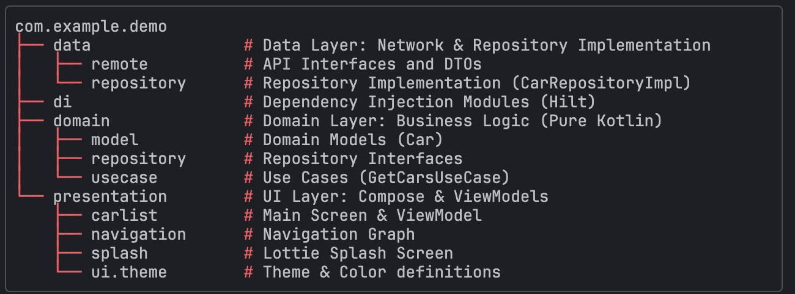

# List cars Demo App MVVM clear Archi 🚗

A modern Android application built with **Kotlin** and **Jetpack Compose**, demonstrating Clean Architecture and MVVM patterns. The app fetches car models from a remote API, simulates pricing and imagery, and allows users to browse vehicles by brand.

## 👤 Author

**JOUBITI MOHAMMED**

---

## 📱 Features

*   **Splash Screen:** Animated entry using Lottie animations.
*   **Car Listing:** Fetches real car models from the Car Query API.
*   **Brand Filtering:** Browse cars by categories (Renault, Ford, Toyota, Fiat, Audi).
*   **Dynamic UI:**
    *   **Pull-to-Refresh:** Swipe down to reload data.
    *   **Image Loading:** Asynchronous image loading using Glide.
    *   **Simulated Data:** Generates estimated prices and assigns high-quality images based on the car brand (to enrich the limited API data).
*   **State Management:** Handles Loading, Success, and Error states gracefully.

## 🛠 Tech Stack

This project utilizes modern Android development tools and libraries:

*   **Language:** [Kotlin](https://kotlinlang.org/)
*   **UI:** [Jetpack Compose](https://developer.android.com/jetpack/compose) (Material3 Design)
*   **Architecture:** MVVM (Model-View-ViewModel) + Clean Architecture
*   **Dependency Injection:** [Dagger Hilt](https://dagger.dev/hilt/)
*   **Network:** [Retrofit](https://square.github.io/retrofit/) + [OkHttp](https://square.github.io/okhttp/)
*   **JSON Parsing:** [Gson](https://github.com/google/gson)
*   **Async Programming:** [Kotlin Coroutines](https://kotlinlang.org/docs/coroutines-overview.html) & [Flow](https://kotlinlang.org/docs/flow.html)
*   **Image Loading:** [Glide](https://github.com/bumptech/glide) (Compose Integration)
*   **Animations:** [Lottie](https://airbnb.design/lottie/)
*   **Navigation:** Jetpack Compose Navigation
*   **Testing:** JUnit 4, MockK, Kotlin Coroutines Test

## 📂 Project Structure
The project follows the Clean Architecture principles, separating concerns into three main layers:

## 🚀 Getting Started

### Prerequisites

*   Android Studio Ladybug or newer.
*   JDK 17 or newer.
*   Android SDK API Level 24+.

### Installation

1.  Clone the repository.
2.  Open the project in Android Studio.
3.  Sync the Gradle files.
4.  Run the app on an Emulator or Physical Device.

## 🧪 Testing

The project includes Unit Tests for the `ViewModel` and `UseCases`.

**Running Tests:**
You can run the tests directly from Android Studio by right-clicking the `com.example.demo (test)` folder and selecting **Run Tests**.

**Test Coverage:**
*   **CarListViewModelTest:** Verifies UI state transitions (Loading -> Success) using Coroutine Test Dispatchers.
*   **GetCarsUseCaseTest:** Verifies business logic using a Fake Repository pattern to isolate dependencies.

## 🔌 API Reference

This app consumes the **Car Query API**:

*   Base URL: `https://www.carqueryapi.com/api/0.3/`
*   Endpoint used: `getModels`

*Note: Since the API only provides raw model names, the `CarRepositoryImpl` enriches the data with simulated prices, descriptions, and images for a better UI demonstration.*

## 🎥 App Demo

Check out the application in action, featuring the Splash Screen animation and the Pull-to-Refresh functionality:

